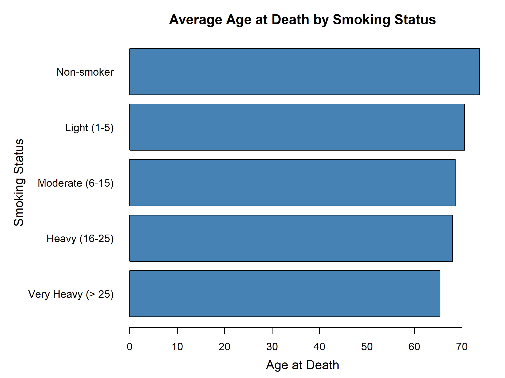

### Assignment 1: Five Base Graphic Charts

Use any data of your choice to produce five different R Base Graphic Charts 

### Assignment 2:  Reproducing the Smoking and Lifespan Chart 

In this exercise, you will use the `heart` dataset from the Framingham Heart Study, located in the `data` directory, to reproduce a chart comparing mean age at death across five smoking status categories, ranging from *Very Heavy (\> 25)* to *Non-smoker*.

{fig-align="center" width="70%" fig-alt="A horizontal bar chart comparing the average age at death based on smoking status. The categories, from top to bottom, are Very Heavy (> 25), Heavy (16-25), Moderate (6-15), Light (1-5), and Non-smoker. The x-axis represents the average age at death, and the source is the Framingham Heart Study."}

The example chart is a horizontal bar plot where each bar represents a different smoking status category: *Very Heavy (\> 25)*, *Heavy (16–25)*, *Moderate (6–15)*, *Light (1–5)*, and *Non-smoker*. The x-axis shows mean age at death, allowing the categories to be compared visually without implying a causal relationship.

**1. Data Description**

- The `heart` dataset contains cardiovascular health data from the Framingham Heart Study, including variables such as `age_at_death` and `smoking_status`.

- The smoking status categories include:\
  *Non-smoker*, *Light (1–5)*, *Moderate (6–15)*, *Heavy (16–25)*, and *Very Heavy (\> 25)*.

- Note that some variables (for example, `smoking_status`) may contain missing values.

**2. Objective**

1.  **Filter** the dataset to remove any rows where `smoking_status` is missing.

2.  **Group** the data by `smoking_status`.

3.  **Calculate** the mean `age_at_death` for each smoking category.

4.  **Visualise** the results using **base R graphics** by creating a **horizontal bar plot** that:

    - Places average age at death on the x-axis.\
    - Shows smoking status on the y-axis, in the order *Very Heavy (\> 25)* down to *Non-smoker*.\
    - Uses a consistent colour for the bars, such as `"steelblue"`.\
    - Includes a clear title and axis labels.\
    - Adjusts margins and labels so that the chart is easy to read.

**3. Deliverables**

- **Explanation**: Provide a concise description of how you filtered, summarised, and plotted the data. No code is required in this explanation; focus on the rationale for each step.

- **Final Plot**: Produce a horizontal bar plot that closely matches the example and save it as a PNG or PDF file.

- **Interpretation**: Write a brief summary of the pattern shown in the chart and what it suggests about the association between smoking status and mean age at death.

::: callout-tip
You will need to use **dplyr** for data manipulation and `barplot()` from Base R for the visualisation. When creating horizontal bars, pay attention to the order of the categories and adjust the margins and labels where necessary to keep the final chart clear and readable.
:::
