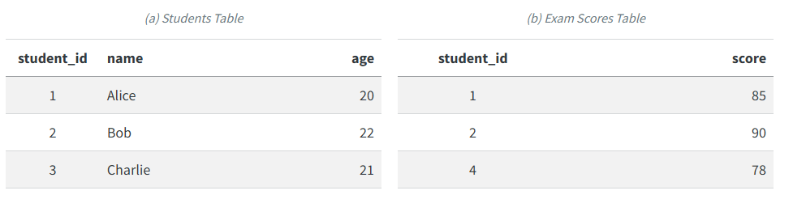
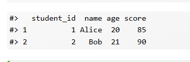
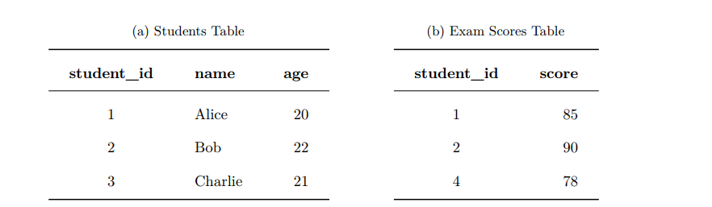
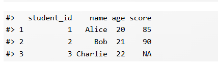
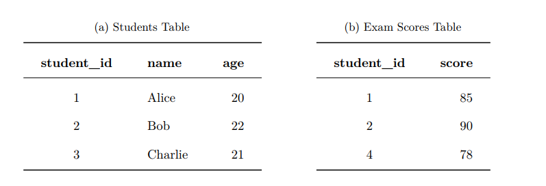
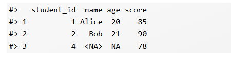
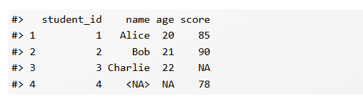
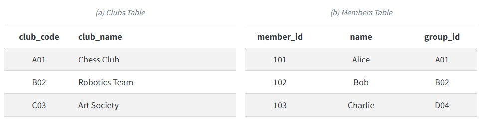
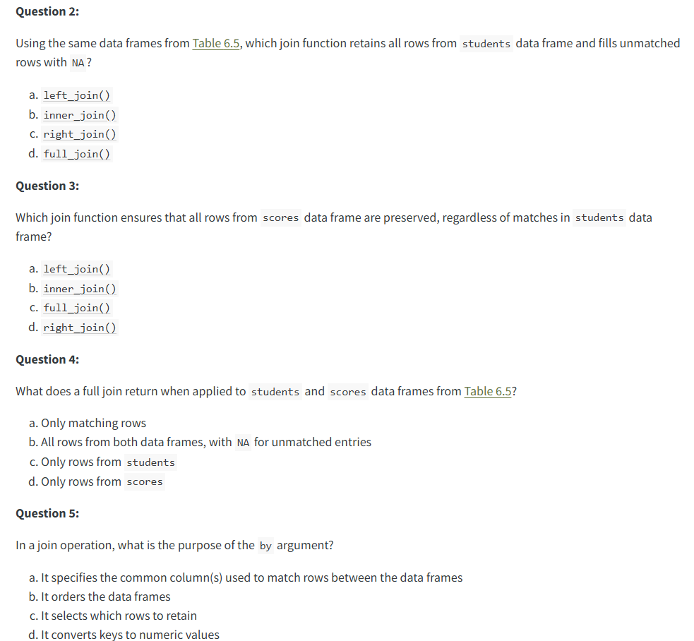
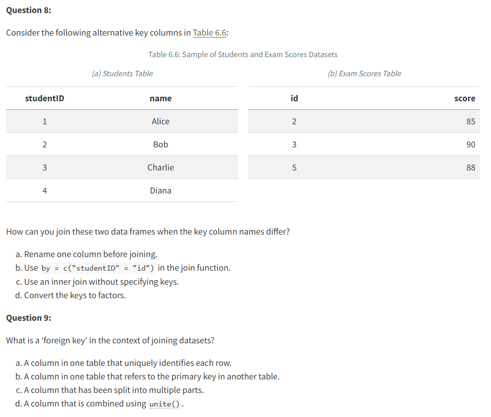

# How to join datasets together

To join datasets together, you can use various methods to join datasets:

- inner join

- left join

- right join

- full join

`dplyr` package makes joining easier by using the following general format:

`type_join(x, y, by = "key_column")`

where

- `` `type_ `` refers to the kind of join

- `x` is the first table

- `y` is the second table

- `by` specifies the column or columns used to match rows

**The role of key in joining datasets**

- primary key

- foreign


**Inner join**

An inner join keeps only the rows for which the key appears in both tables. Rows without a matching key in either table are excluded. This makes it the most restrictive type of join.



```{r}
library(tidyverse)
```



**Left join**

A left join keeps all rows from the left table and adds matching information from the right table. When there is no match, the new columns from the right table contain `NA`.



```{r}

```



**Right join**

A right join keeps all rows from the right table and matches them with rows from the left table. Rows in the right table without a match receive`NA`values for columns from the left table.



```{r}

```



**Full join**

A full join retains all rows from both tables. Matching rows are combined, while non matching rows receive `NA` values where data are missing.

](images/clipboard-1783795568.png)

```{r}

```

### **Joins with Different Key Names**

In practice, columns that represent the same information often have different names across tables. For instance, a primary key in one dataset may be called `club_code`, while the corresponding foreign key in another dataset is named `group_id`. The join functions in **dplyr** are designed to handle such situations with ease.



`type_join(x, y, by = c("key_column_tbl1" = key_column_tbl2)`

```{r}
clubs <- tibble(
  club_code = c("A01", "B02", "C03"),
  club_name = c("Chess Club", "Robotics Team", "Art Society")
)

members <- tibble(
  member_id = 101:103,
  name = c("Alice", "Bob", "Charlie"),
  group_id = c("A01", "B02", "D04")
)
```

```{r}
clubs |> 
  inner_join(members, by = c("club_code" = "group_id")) |> 
  select(name, member_id, club_name)
```

**Reflective Question**

](images/clipboard-1629425155.png)



### **Class work: Relational Analysis with the NYC Flights 2013 Dataset**

This exercise develops your relational analysis skills using the `nycflights13` dataset, which is distributed as an R package. The dataset is widely used for teaching and learning data manipulation with relational tables.

#### Dataset Metadata

The `nycflights13` dataset contains information on all 336,776 outbound flights from New York City airports in 2013. These airports include Newark Liberty International Airport (EWR), John F. Kennedy International Airport (JFK) and LaGuardia Airport (LGA). The data are compiled from multiple sources, including the United States Bureau of Transportation Statistics.

The dataset is designed to support the exploration of relationships between flight operations, aircraft characteristics, airport information, weather conditions and airline carriers. It consists of five main tables:

- **flights:** Records of individual flights, including departure and arrival times, delays and key identifiers such as `tailnum` (aircraft tail number), `origin` (departure airport), `dest` (destination airport) and `carrier` (airline code). This table contains 336,776 rows and 19 columns.

- **planes:** Information about aircraft, including manufacturer, model and year of manufacture. Records are linked to flights using the `tailnum` key. This table contains 3,322 rows and 9 columns.

- **airports:** Airport level information such as name, latitude and longitude, linked by the `faa` airport code used in `flights$origin` and `flights$dest`. This table contains 1,458 rows and 8 columns.

- **weather:** Hourly weather observations for New York City airports, linked by `origin` and `time_hour`. This table contains 26,115 rows and 15 columns.

- **airlines:** Airline names and their corresponding carrier codes, linked by the `carrier` variable. This table contains 16 rows and 2 columns.

#### Tasks

1.  **Importing and Inspecting Data**

    - Install and load the `nycflights13` package in your R environment.

    - Access the `flights` and `planes` tables and inspect their structure to familiarise yourself with the available variables.

    - Identify the common key, `tailnum`, that links flights and planes, and note any potential mismatches such as flights without corresponding aircraft information.

2.  **Relational Analysis with Joins**

    - Perform an `inner_join` between `flights` and `planes` using the `tailnum` key. How many rows are returned, and why does this number differ from the total number of flights?

    - Perform a `left_join` between `flights` and `planes` using the same key. Compare the number of rows with the original `flights` table and explain what happens to flights that do not have matching plane records.

    - Perform a `right_join` between `flights` and `planes`. How does this result differ from the left join, and what does it reveal about aircraft that were not used in recorded flights?

    - Perform a `full_join` between `flights` and `planes`. Describe how this output combines information from both tables, including observations with no matching records.

    - After performing a `left_join`, create a summary table showing the number of flights per aircraft manufacturer using `planes$manufacturer`. Handle missing values appropriately, for example by labelling flights without plane data as `"Unknown"`.

    - Produce a bar plot showing the distribution of flights across the top five aircraft manufacturers based on your summary table.

Happy joining!
