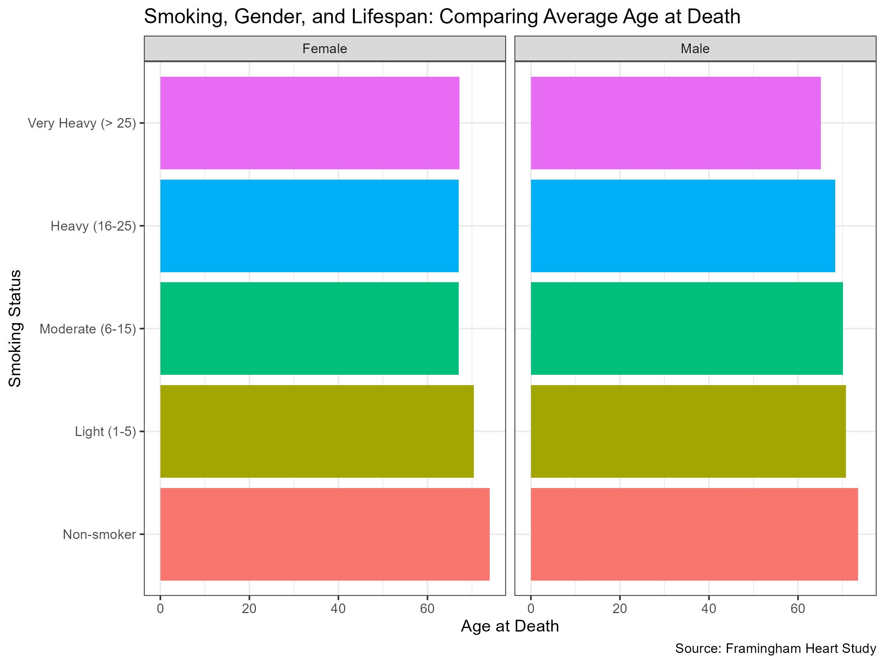

### Exercise 3: Reproducing the Smoking, Gender, and Lifespan Chart

In this exercise, you will use the `heart` dataset from the Framingham Heart Study, located in the `data` directory, to reproduce a chart that compares the average age at death across smoking categories for males and females.

{fig-align="center" width="70%" fig-alt="A horizontal bar chart showing the average age at death by smoking status for males and females. The figure is split into two panels, one for females and one for males. Within each panel, bars represent smoking intensity categories (Non-smoker, Light, Moderate, Heavy, and Very Heavy). The x-axis shows the average age at death, and the source is the Framingham Heart Study."}

The example chart is a horizontal bar chart divided into two panels, one for each sex. Within each panel, individuals are grouped according to smoking intensity. The horizontal axis represents the average age at death, and the data source is the Framingham Heart Study.

**1. Data Description**

- The `heart` dataset contains cardiovascular health information from the Framingham Heart Study, including variables such as `sex`, `age_at_death`, and `smoking_status`.

- Smoking status is recorded using five ordered categories: *Non-smoker*, *Light (1–5)*, *Moderate (6–15)*, *Heavy (16–25)*, and *Very Heavy (\> 25)*.

- Some variables, including `smoking_status`, may contain missing values and should be handled appropriately before analysis.

**2. Objective**

Your task is to perform the following steps:

- Filter the dataset to exclude observations with missing values for `smoking_status`.

- Group the data by smoking_status and sex.

- Compute the mean age at death for each group.

- Create a visualisation using **ggplot2** that:

  - Displays average age at death on the x-axis.

  - Lists smoking status categories on the y-axis.

  - Uses faceting to create separate panels for females and males.

  - Applies colour or fill to distinguish between smoking categories.

  - Includes a clear title and informative axis labels.

**3. Deliverables**

- A short written explanation describing your analytical approach and visualisation choices. No code is required for this part.

- A bar chart that closely matches the reference figure, saved as a PNG or PDF file.

- A brief summary explaining what the chart reveals about the relationship between smoking behaviour, sex, and average age at death.

::: callout-tip
You will need both **dplyr** for data preparation and **ggplot2** for visualisation. Focus on computing the mean of `age_at_death` for each combination of smoking status and sex before creating the plot.
:::

Good luck, and enjoy working with the data!
