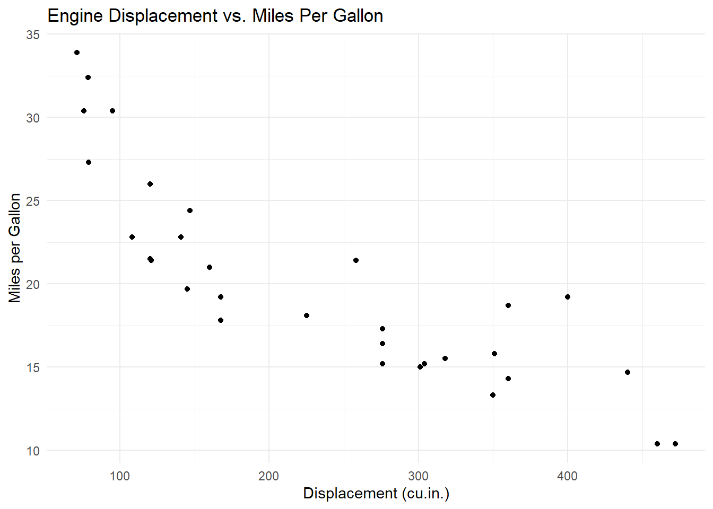
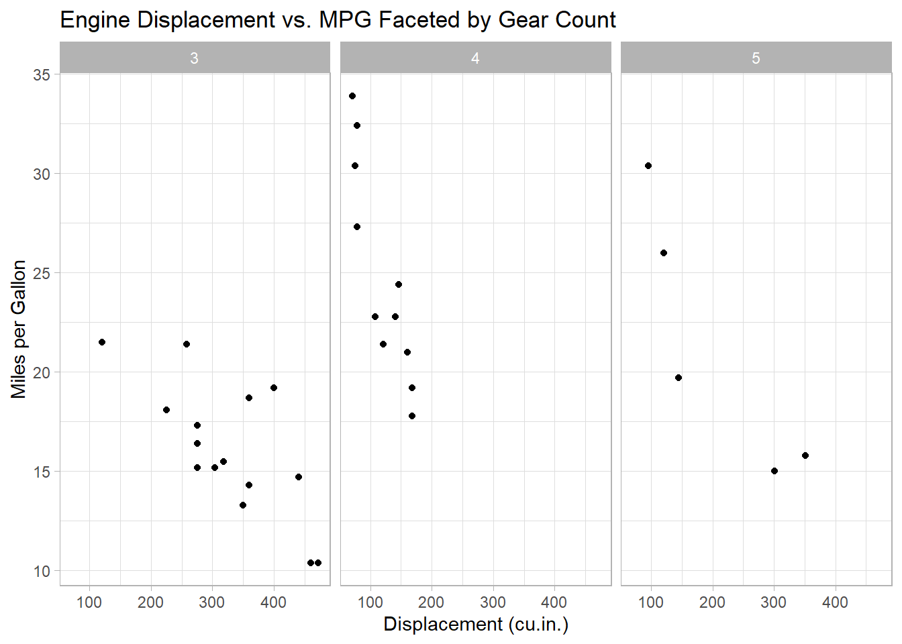
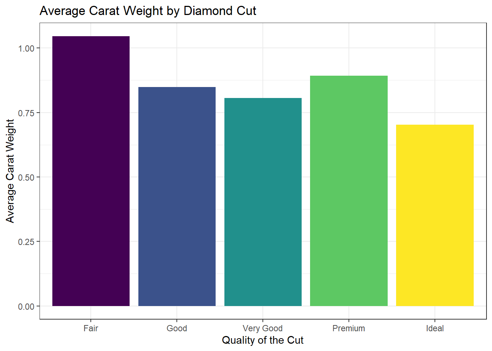

## Base R Graphics

- [`plot()`](https://rdrr.io/r/graphics/plot.default.html) creates scatterplots, line charts, and other basic plots.

- [`hist()`](https://rdrr.io/r/graphics/hist.html) displays the distribution of a numeric variable.

- [`boxplot()`](https://rdrr.io/r/graphics/boxplot.html) produces box-and-whisker plots for summarising distributions.

- [`barplot()`](https://rdrr.io/r/graphics/barplot.html) generates bar charts for categorical data.

- [`pie()`](https://rdrr.io/r/graphics/pie.html) generates pie charts for categorical data

Key graphical parameters include the following.

- **Colour (`col`)**:\
  The `col` parameter specifies colours for plot elements such as points, lines, bars, and text. Colours can be defined by name (e.g. `"blue"`, `"red"`), numeric index, or hexadecimal code (e.g. `"#FF0000"`). A vector of colours may also be supplied to distinguish groups within a plot.

- **Point symbols (`pch`)**\
  The `pch` parameter controls the appearance of points in scatterplots and line plots. Numeric values from 0 to 25 correspond to different symbols. For example, `pch = 19` produces solid circular points, which are often preferred for clarity.

- **Line width and type (`lwd` and `lty`)**\
  The `lwd` parameter adjusts line thickness, while `lty` controls line patterns such as solid, dashed, or dotted. These parameters are useful for highlighting trends or emphasising specific lines.

- **Scaling of element sizes (`cex`)**\
  The `cex` parameter scales the size of plot elements, including points and text. Values greater than 1 increase size, while values less than 1 reduce it.

- **Titles and axis labels (`main`, `xlab`, `ylab`)**\
  Clear labelling improves interpretability. The `main` argument sets the plot title, while `xlab` and `ylab` label the horizontal and vertical axes.

- **Adjusting Margins and Layout ([`par()`](https://rdrr.io/r/graphics/par.html))**\
  The [`par()`](https://rdrr.io/r/graphics/par.html) function controls global settings such as margins, text orientation, font size, and multi-panel layouts. For example, `par(mfrow = c(2, 2))` creates a 2 by 2 plotting grid.

#### Creating a Scatter Plot

Using the `mtcars` dataset, we begin by visualising the relationship between engine displacement and fuel efficiency.

```{r}
plot(mtcars$mpg, # x
     mtcars$disp,   # y
     main = "Engine Displacement vs. Miles per Gallon",   
     xlab = "Displacement (cu.in.)",   
     ylab = "Miles per Gallon",   
     col = "blue")
```

```{r}
# Base scatter plot using a formula interface
plot(mpg ~ disp,
     data = mtcars,
     main = "Linear Regression of MPG on Displacement",
     xlab = "Displacement (cu.in.)",
     ylab = "Miles per Gallon",
     pch = 19
)

# Adding a linear regression line
abline(lm(mpg ~ disp, data = mtcars),
       col = "blue",
       lwd = 1
)
```

#### Creating Boxplots

Boxplots provide a concise summary of a variable’s distribution, including its median, spread, and potential outliers. Using the `heart` dataset, we can examine the distribution of weight.

```{r}

library(tidyverse)
library(readxl)
library(janitor)
heart <- read_xlsx("data/heart.xlsx") |> 
  clean_names()
  
boxplot(heart$weight,   
        main = "Distribution of Weight",   
        ylab = "Weight (pounds)",   
        col = "lightblue" )
```

```{r}
boxplot(weight ~ bp_status,
        data = heart,
        col = terrain.colors(3),
        main = "Distribution of Weight by Blood Pressure Status",
        xlab = "Blood Pressure Status",
        ylab = "Weight (pounds)"
)
```

#### Creating a Histogram

To examine the distribution of diamond carat sizes, use the [`hist()`](https://rdrr.io/r/graphics/hist.html) function.

```{r}
hist(diamonds$carat, 
     col = "lightblue",   
     main = "Distribution of Diamond Carat Sizes", 
     xlab = "Carat",   
     ylab = "Frequency" )
```

```{r}
# Calculate Sturges number of bins
k <- nclass.Sturges(diamonds$carat)

diamonds |> 
  ggplot(aes(x = carat)) +
  geom_histogram(fill = "blue", bins = k, boundary = 0)
```

```{r}
table(mtcars$carb)
barplot(table(mtcars$carb),
        main = "Number of Cars by Carburetor Count",
        xlab = "Number of Carburetors",
        ylab = "Count",
        col = "skyblue"
)

```

```{r}
# Create a table of counts
counts <- table(mtcars$carb)
# Create the bar chart and store the bar midpoints
bar_midpoints <- barplot(counts,
                         main = "Number of Cars by Carburetor Count",
                         ylim = c(0, 12),
                         xlab = "Number of Carburetors",
                         ylab = "Count",
                         col =  terrain.colors(length(counts))
)
# Add value labels above each bar
text(
  x = bar_midpoints,
  y = counts,
  labels = counts,
  pos = 3, # Position text above the bar
  cex = 0.8, # Adjust text size as needed
  col = "black"
)
```

```{r}
payments <- c(
  Check = 46.861,
  CreditCard = 36.681,
  Debit = 28.860,
  Digital = 18.900,
  Cash = 4.802
)

pie(payments,
    main = "Average Transactions by Payment Type",
    col = rainbow(5)
)
```

```{r}
# Combine each payment method with its value
pie_labels <- paste(
  names(payments),
  round(payments, 1),
  sep = ": "
)

pie(
  payments,
  main = "Average Transaction Amount by Payment Type",
  col = rainbow(length(payments)),
  labels = pie_labels
)
```

```{r}
payments_df <- data.frame(
  channel = names(payments),
  transaction = as.numeric(payments)
)

payments_df
```

```{r}
lessR::Chart(
  x = channel,
  y = transaction,
  data = payments_df,
  type = "bar",
  fill = terrain.colors(5),
  labels = "input",
  labels_position = "out",
  main = "Average Transaction Amount by Payment Type"
)
```

```{r}
plot(unemploy ~ date,
     data = economics,
     type = "l",
     main = "Unemployment Trends Over Time",
     xlab = "Year",
     ylab = "Unemployed (thousands)",
     col = "blue",
     lwd = 2
)
```

```{r}
# Create an empty plotting region
plot(unemploy ~ date,
     data = economics,
     type = "n",
     ylim = c(0, max(economics$unemploy, na.rm = TRUE)),
     main = "US Unemployment Trends Over Time",
     xlab = "Year",
     ylab = "Unemployed (thousands)"
)

# Shade the area beneath the trend
polygon(
  c(economics$date, rev(economics$date)),
  c(economics$unemploy, rep(0, nrow(economics))),
  col = rgb(0.1, 0.1, 0.8, 0.3),
  border = NA
)

# Draw the trend line over the shaded area
lines(
  economics$date,
  economics$unemploy,
  col = "darkblue",
  lwd = 2
)
```

#### Saving Your Plots

Base R plots can be saved by opening a graphics device, creating the plot, and then closing the device. Common file-based graphics devices include [`png()`](https://rdrr.io/r/grDevices/png.html), [`jpeg()`](https://rdrr.io/r/grDevices/png.html), and [`pdf()`](https://rdrr.io/r/grDevices/pdf.html). The [`dev.off()`](https://rdrr.io/r/grDevices/dev.html) function closes the current graphics device.

```{r}
# Open a PNG graphics device
png(
  filename = "scatterplot.png",
  width = 800,
  height = 600
)

# Create the scatter plot
plot(mpg ~ disp,
     data = mtcars,
     main = "MPG vs. Displacement with Regression Line",
     xlab = "Displacement (cu.in.)",
     ylab = "Miles per Gallon",
     pch = 19
)

# Close the graphics device
dev.off()
```
