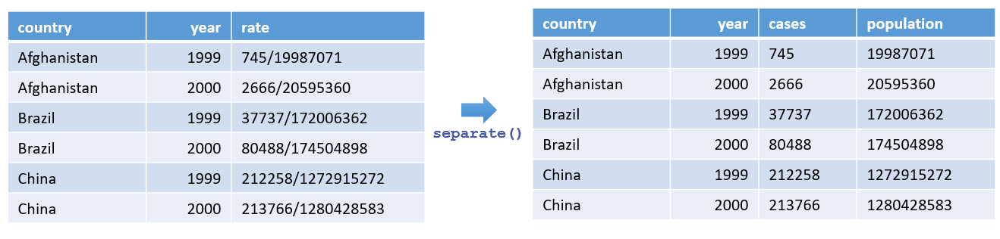
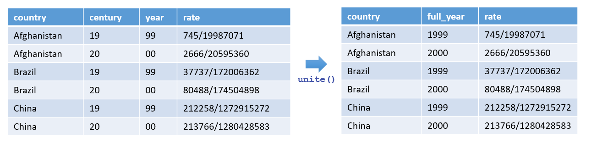

# Advanced Data Transformation

# Tidy Data

Tidy data principle:

- Each column is a variable
- Each observation is a row
- Each cell contains a single value


```{r}
staff_data <- data.frame(
  Name = c("Alice", "Bob", "Charlie"),
  Age = c(30, 25, 35),
  Department = c("HR", "IT", "Finance")
)
staff_data

```


Tidy data principle:

- Each column is a variable
- Each observation is a row
- Each cell contains a single value


## From wide data to long data


```{r}
pivot_longer(
  cols = <columns to reshape>, 
  names_to = <column for variable names>,  
  values_to = <column for values>
)
```

## From long data to wide data


```{r}
pivot_wider(
  names_from = <column for new column names>,
  values_from = <column for values>
)
```

## Example 1:


```{r}
sales_data_wide <- data.frame(
  Month = c("Jan", "Feb", "Mar"),
  North = c(200, 220, 210),
  East  = c(180, 190, 200),
  South = c(150, 140, 160),
  West  = c(177, 183, 190)
)

sales_data_wide
```

**pivot_longer**( cols = **\<**columns to reshape**\>**, names_to = **\<**column **for** variable names**\>**, values_to = **\<**column **for** values**\>** )

```{r}

sales_data_long <- sales_data_wide |> 
  pivot_longer(
  cols = c(North, East, South, West), # 2:5 or -Month, 
  names_to = "Region",  
  values_to = "Sales"
)
sales_data_long
```

## Example 2


```{r}
# Create from scratch
sales_data_long <- data.frame(
  Month = c("Jan", ...),
  Region = c("North", ...),
  Sales = c(200, 220, ...)
)
```

```{r}
# We have it already in example 2

sales_data_long
```

**pivot_wider**( names_from = **\<**column **for** new column names**\>**, values_from = **\<**column **for** values**\>** )

```{r}
sales_data_long |> 
  pivot_wider(
    names_from = Region,
    values_from = Sales
  )
```

## Splitting and combining columns



separate( data, col = <column to split>, into = <new columns>, sep = <separator>, remove = <logical flag> )

```{r}
# Create the data frame
tb_cases <- tibble(
  country = c("Afghanistan", "Afghanistan", "Brazil", "Brazil", "China", "China"),
  year = c(1999, 2000, 1999, 2000, 1999, 2000),
  rate = c(
    "745/19987071", "2666/20595360", "37737/172006362", "80488/174504898",
    "212258/1272915272", "213766/1280428583"
  )
)

tb_cases
```

```{r}
tb_cases |>
  separate(
    col = rate,
    into = c("cases", "population"),
    sep = "/"
  )
```



unite( data, col = <name of new column>, ..., sep = <separator>, remove = <logical flag>)

```{r}
tb_cases <- tibble(
  country = c(
    "Afghanistan", "Afghanistan", "Brazil", "Brazil", "China",
    "China"
  ),
  century = c("19", "20", "19", "20", "19", "20"),
  year = c("99", "00", "99", "00", "99", "00"),
  rate = c(
    "745/19987071", "2666/20595360",
    "37737/172006362", "80488/174504898",
    "212258/1272915272", "213766/1280428583"
  )
)

tb_cases
```

```{r}
tb_cases |>
  unite(col = year, century, year, sep = "_")
```


